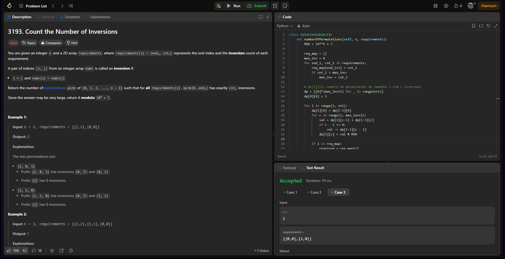
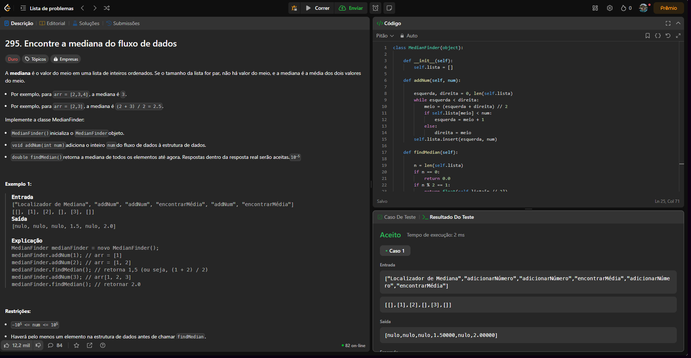
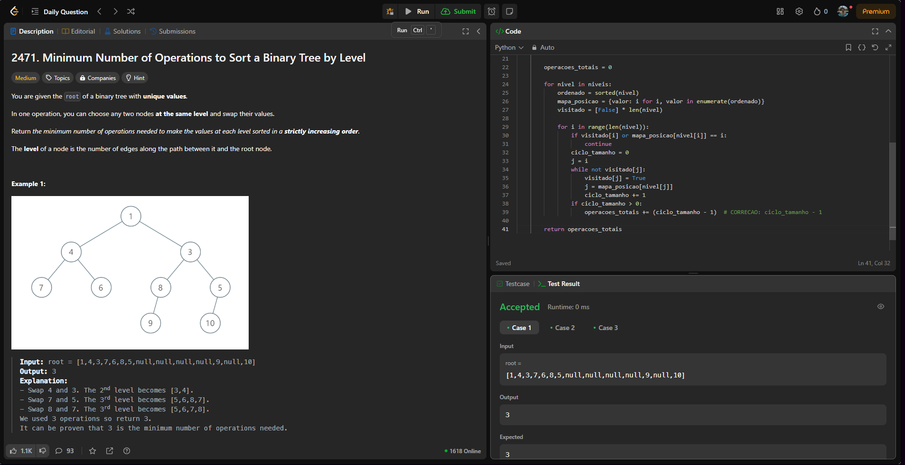

# DividirConquistar_Desafios_LeetCode

**Conteúdo da Disciplina**: Dividir e Conquistar 

## Alunos

| Matrícula  | Aluno                       |
| ---------- | --------------------------- |
| 21/1030809 | JULIO CESAR ALMEIDA DOURADO |

## Sobre

Meu projeto é a resolução de problemas do LeetCode.

## Link de apresentação no Youtube

[Clique aqui](https://youtu.be/B19REN0ZtTU)

## Screenshots do Projeto em Funcionamento

Aqui estão algumas imagens do projeto em funcionamento:

#### Desafio 1 [3193. Count the Number of Inversions(HARD)](https://leetcode.com/problems/count-the-number-of-inversions/)

#### Desafio 2 [295. Find Median from Data Stream(HARD)](https://leetcode.com/problems/find-median-from-data-stream/description/)

#### Desafio 3 [2471. Minimum Number of Operations to Sort a Binary Tree by Level(MEDIUM)](https://leetcode.com/problems/minimum-number-of-operations-to-sort-a-binary-tree-by-level/)

## Modo de uso

versão do Python: 3.13.0

Para rodar o arquivo manualmente: 
`python nomeDoArquivo.py`
